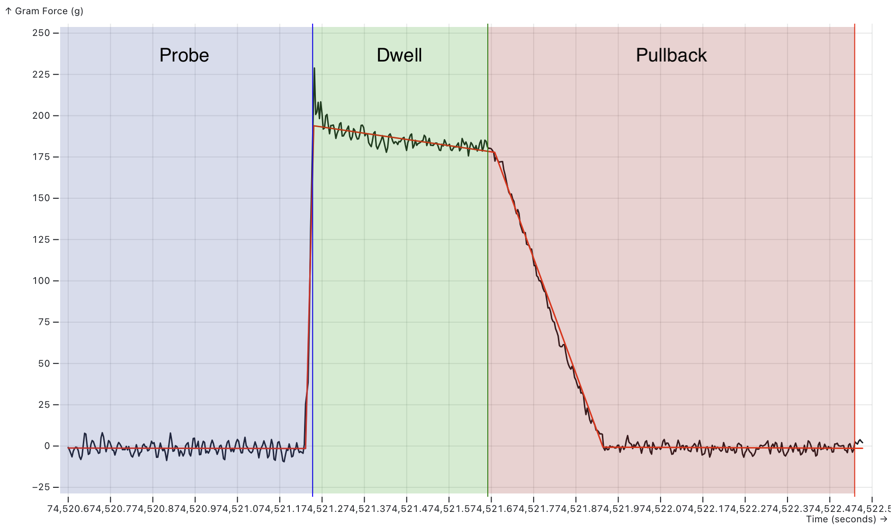
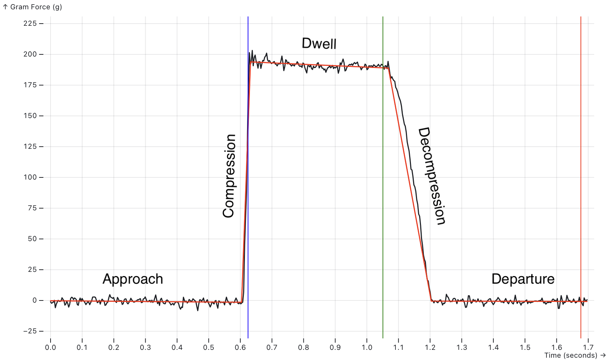
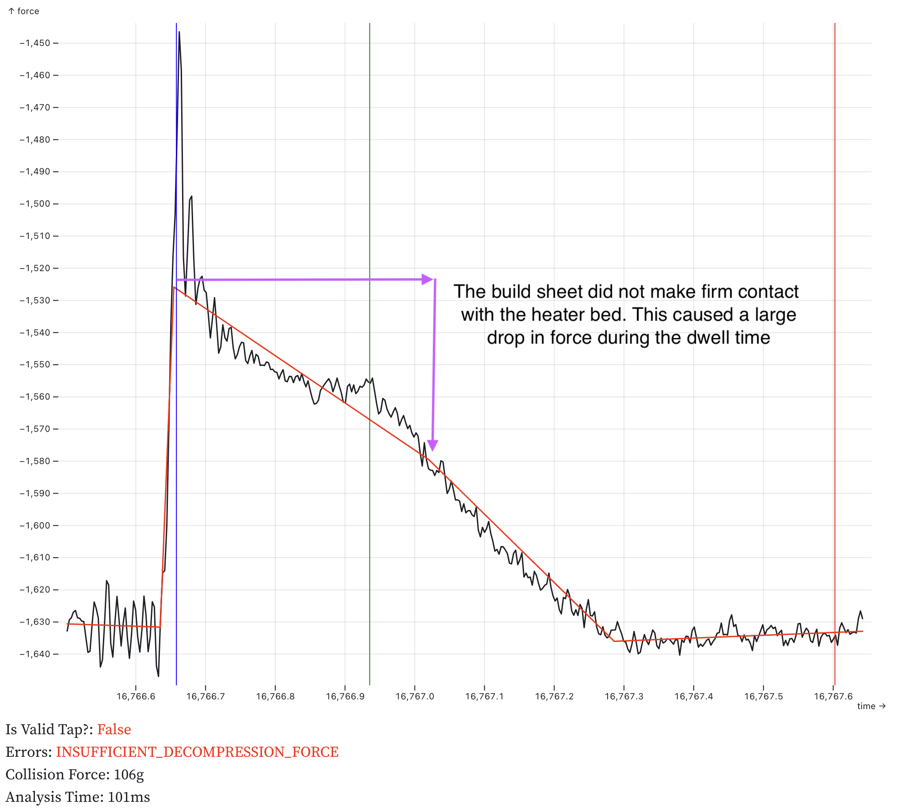
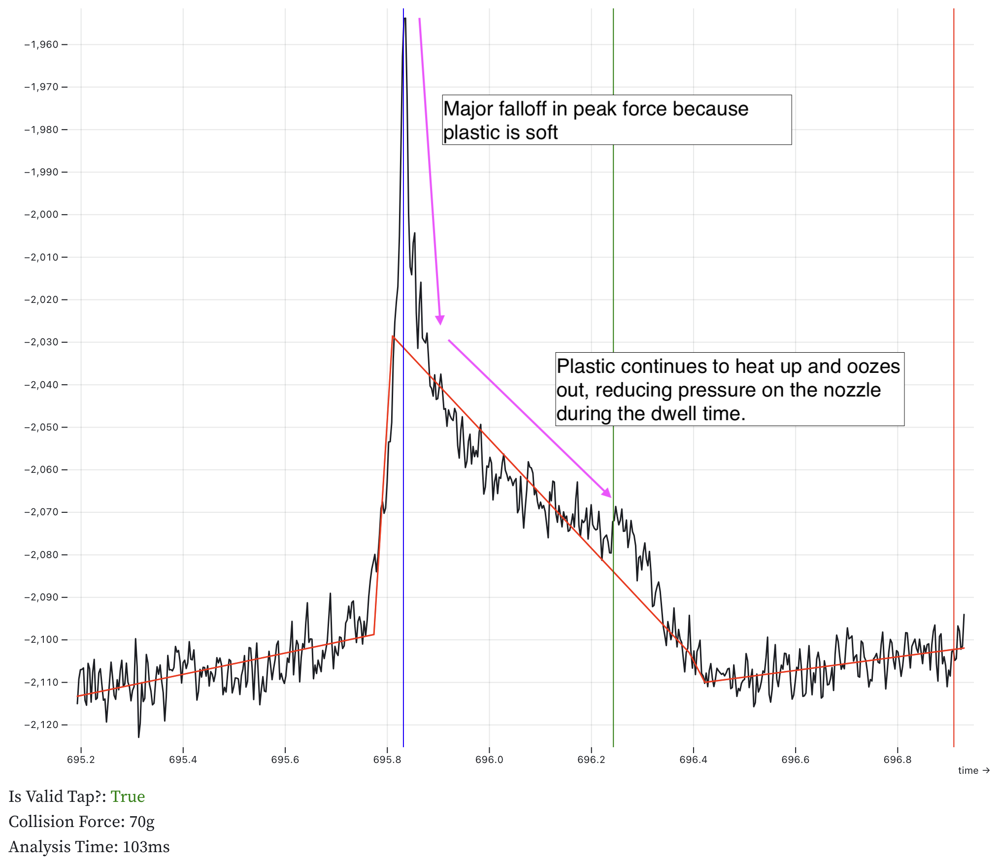
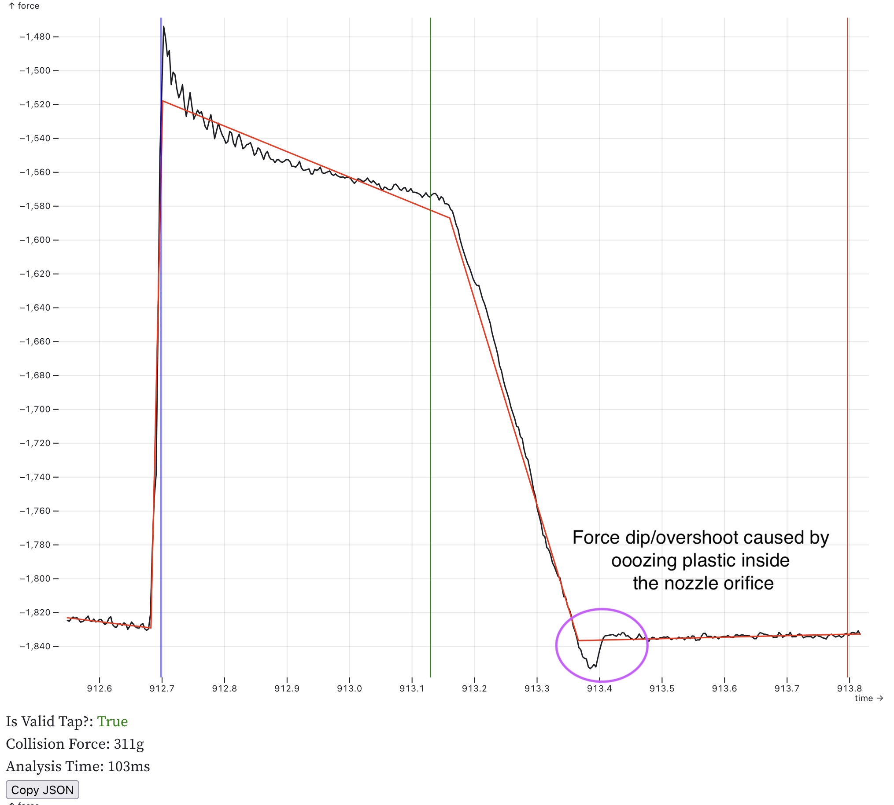
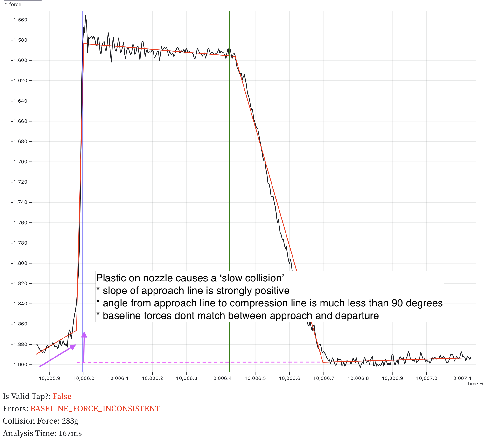

# Load Cells

This document describes support for load cells. Load cells measure applied force applied to a strain gauge with an ADC. They may be used to read force data, weigh things like filament spools, or function as a probe.

Warning: Prior to using a load cell it must be calibrated. If not correctly calibrated the force/weight reported will be incorrect and this may result in permanent damage to your load cell and/or printer. This module cannot compensate for poor calibration, damaged strain gauges or electrical noise.

## Basic Load Cell Configuration

Load cells can be configured for use as a scale.

```ini
[load_cell]
sensor_type: hx717
sclk_pin: PA5
dout_pin: PA4
sample_rate: 320
counts_per_gram: 245
reference_tare_counts: 12345
```

- `sensor_type: hx717`\
  _Required_\
  Each sensor has different required fields, check their configuration reference for details:

  * [`hx711`](Config_Reference.md#hx711)
  * [`hx717`](Config_Reference.md#hx717)
  * [`ads1220`](Config_Reference.md#ads1220)
  * [`ads131m02`](Config_Reference.md#ads131m02)
  * [`ads131m04`](Config_Reference.md#ads131m04)

- `counts_per_gram: 245`\
  _Default Value: None_\
  Conversion factor from raw sensor counts to grams, calculated by `LOAD_CELL_CALIBRATE`.

- `reference_tare_counts: 12345`\
  _Required_\
  Baseline tare value in raw sensor counts, set by `LOAD_CELL_CALIBRATE`.

## Diagnostics

### Checking Load Cell Operation

`LOAD_CELL_DIAGNOSTIC` ([docs](G-Codes.md#load_cell_diagnostic))

Collects samples from the load cell and reports health and statistics. Run this command when first connecting a load cell to verify wiring and configuration.

```
LOAD_CELL_DIAGNOSTIC
// Collecting load cell data for 10 seconds...
// Samples Collected: 3211
// Measured samples per second: 332.0
// Good samples: 3211, Saturated samples: 0, Unique values: 900
// Sample range: [4.01% to 4.02%]
// Sample range / sensor capacity: 0.00524%
```

Check the output:
- Measured samples per second should be close to the configured `sample_rate`. If not, check configuration. For HX711, sample rate is set by hardware.
- Saturated samples should be 0. Non-zero indicates excessive force beyond the sensor's measurement range.
- Unique values should be a large percentage of samples collected. If unique values is 1, verify wiring.
- Tap or push the sensor during the test. The sample range should increase if the sensor is functioning correctly.

## Calibration

### Calibrating a Load Cell

`LOAD_CELL_CALIBRATE` ([docs](G-Codes.md#load_cell_calibrate))

Starts the interactive calibration utility. The calibration process consists of three steps:

1. `TARE` - Establish zero force value and set `reference_tare_counts`
2. `CALIBRATE GRAMS=<value>` - Apply known force and calculate `counts_per_gram`
3. `ACCEPT` - Save calibration results to configuration

Use `ABORT` to cancel calibration at any time.

Running a `LOAD_CELL_DIAGNOSTIC` after calibration will show additional information in grams.

#### Applying a Known Force

The `CALIBRATE GRAMS=<value>` step requires applying a known force. The method depends on load cell location:

**Platform-mounted load cells** (under bed or filament holder):
Place an object of known mass on the platform. Ideally use a large percentage of the load cell's rated capacity (e.g., 5 kg for a 5 kg load cell).

**Toolhead load cells**:
Place a digital scale on the bed and gently lower the toolhead onto it (or raise the bed if the bed moves). Use at least 1 kg of force. Too much force may damage the bed or toolhead, so move in small steps. Take a reading from the digital scale and enter it into the `CALIBRATE GRAMS=<value>` command.

#### Understanding Calibration Results

```
CALIBRATE GRAMS=555
// Calibration value: -2.78% (-559467), Counts/gram: 87.944082,
Total capacity: +/- 29.14Kg
```

`Calibration value:` shows how much of the sensor's range, as a percentage, was used to calibrate.

`Counts/gram:` is the number of sensor counts equal to 1 gram of force. The larger this number is the more precise the scale will be.

`Total capacity` is the highest force that the sensor could register. The `Total capacity` should be close to the load cell's rated capacity. If much larger, consider a higher gain setting or more sensitive load cell. This is more critical for sensors with bit widths below 24 bits.

## Operations

### Reading Force Data

`LOAD_CELL_READ`

Reads the current force on the load cell.

```
LOAD_CELL_READ
// 10.6g (1.94%)
```

Force data is also available in the `load_cell` printer object:

```gcode

```

This value is averaged over the last 1 second, similar to temperature sensors.

### Taring a Load Cell

`LOAD_CELL_TARE`

Sets the current reading to zero force. Useful for measuring relative weight changes, such as filament consumption during printing.

```
LOAD_CELL_TARE
// Load cell tare value: 5.32% (445903)
```

The tare value is available in the `load_cell` printer object:

```gcode

```

## Load Cell Probe Configuration

This example adds probe functionality to a calibrated load cell. A `[load_cell_probe]` section includes all `[load_cell]` parameters, load cell probing specific parameters and [`[probe]`](Config_Reference.md#probe) parameters.

```ini
[load_cell_probe]
# load cell settings
sensor_type: hx717 # sensor specific config
counts_per_gram: 245
reference_tare_counts: 12345
# load cell probe settings
trigger_force: 75
force_safety_limit: 2000
drift_safety_limit: 1000
drift_filter_cutoff_frequency: 0.5
# probe settings
z_offset: 0.0
```
- `sensor_type: hx717`
- `counts_per_gram: 245`\
  These are the same as for a basic load cell
- `reference_tare_counts: 12345`\
  _Default Value: None_\
  Baseline tare value in raw sensor counts, set by `LOAD_CELL_CALIBRATE`. Used as the zero value for `force_safety_limit` to define the safe operating range.

- `trigger_force: 75`\
  _Default Value: 75 (75 grams)_\
  Force in grams to trigger the endstop during probing, measured relative to the tare value at the start of the probe. Expect overshoot; higher probing speed or lower sample rate increases peak force. See [Multi MCU Homing](Multi_MCU_Homing.md) for multi-MCU timing considerations. The 75g default is conservative. Higher values, up to 200g, can improve performance when handling oozy filament.

- `force_safety_limit: 2000`\
  _Default Value: 2000 (+/-2Kg)_\
  To safely start a probing move, the force on the probe must be below this limit. This treats `reference_tare_counts` as its zero value. This check can be disabled by setting the value to 0. If exceeded, the probe stops with an error `!! Load Cell Probe Error: force of 3000g exceeds force_safety_limit (2000g) before probing!`. This value needs to be large enough to allow for:
  - Bowden tube & drag chain forces that change throughout the print volume & probing move length
  - Temperature drift across the entire probing temperature range

- `drift_safety_limit: 1000`\
  _Default Value: 1000 (+/-1Kg)_\
  This is the most force that the probe will allow during a probing move before triggering an error. Set to 0 to disable this safety check. If exceeded, the probe stops with an error `!! Load Cell Probe Error: force exceeded drift_safety_limit before triggering!`. This safety measure is important when using the `drift_filter_cutoff_frequency` as it is possible to defeat probe triggering with too high of a cutoff frequency.

- `drift_filter_cutoff_frequency: 0.5`\
  _Default Value: None (disabled)_\
  Cutoff frequency in Hz for the continuous tare drift filter. Enables a filter on the MCU to track drift from bowden tubes and drag chains. Requires [SciPy](#installing-scipy). Setting this value too high can delay probe triggering and increase force on the toolhead.

- `z_offset: 0.0`\
  _Required_\
  The distance (in mm) between the bed and the nozzle when the probe triggers. For load cell probes this is 0.

See the [configuration reference](Config_Reference.md#load_cell_probe) for all available options.

### Safety

Load cells are direct nozzle contact probes. The system includes safety checks to prevent excessive force on the toolhead. Poorly chosen configuration values can defeat these protections.

**Calibration check:**
Before homing or probing, the load cell probe checks that it is calibrated. If not, the printer stops with error `!! Load Cell Probe Error: Load Cell not calibrated`.

**Accurate `counts_per_gram`:**
This setting converts raw counts to grams. All safety limits are in gram units. An inaccurate value allows excessive force on the toolhead. Never guess this value—always use `LOAD_CELL_CALIBRATE`.

**Conservative `trigger_force`:**
Probing always overshoots `trigger_force` before stopping. A setting of 100 g may result in 350 g peak force. Overshoot increases with faster probing speed, low sample rate, or multi-MCU configurations.

**`force_safety_limit` protection:**
This setting detects excessive force on the probe before starting homing or probing. If the limit is exceeded, the probe will stop with an error, e.g. `!! Load Cell Probe Error: force of 3000g exceeds force_safety_limit (2000g) before probing!`. This could be caused by: 
- The probe colliding with the bed before probing starts. e.g. by moving horizontally into a tilted bed
- Excessive force from the bowden tube or drag chain
- Excessive force on the strain gauge caused by the extruder pushing on the filament
- A damaged strain gauge, causing the zero point to move too far from the `reference_tare_counts` value

**`drift_safety_limit` protection:**
This sets the most force the probe will allow before it triggers. If the measured force changes by more than the limit, the probe will stop with an error: `!! Load Cell Probe Error: force exceeded drift_safety_limit before triggering!`. This could be triggered for several reasons:
- The probe being actively heated while probing, causing the tare value to drift
- Setting the `drift_filter_cutoff_frequency` too high, causing the tap event to be filtered out
- A large change in the bowden tube/drag chain force while probing

**Watchdog task:**
During homing, a watchdog monitors sensor data. If the sensor fails to send measurements for 2 sample periods, the MCU shuts down with error `!! Load Cell Probe Error: timed out waiting for sensor data`. This usually indicates an ADC fault or inadequate grounding. Ensure the frame, power supply, and print bed are grounded. Multiple ground connections may be required. Sand anodized aluminum at ground connection points for good electrical contact.

**Tap validation and retries:**
The probe validates each tap's shape, break-contact timing, and motion chronology. Invalid taps are rejected (`is_valid=False`) and retried based on the probe's configured `bad_probe_strategy` and `bad_probe_retries`. This prevents accepting fouled or poor-quality taps. See [Tap validation error codes](#tap-validation-error-codes) for validation failure types. Note that validation catches many but not all bad taps, proper nozzle temperature and cleanliness remain essential.

### Testing Probe Operation

`LOAD_CELL_TEST_TAP [COUNT=<taps>] [TIMEOUT=<seconds>]`\
_Default COUNT: 3_\
_Default TIMEOUT: 30_

Tests probe operation without moving axes. Detects the specified number of taps before ending. If no tap is detected within the timeout period, the command fails. The command validates tap quality and logs validation errors to the console.

**Note:** Load cell probes do not support `QUERY_ENDSTOPS` or `QUERY_PROBE`, they always return not triggered. Use `LOAD_CELL_TEST_TAP` to verify functionality before probing.

### Homing Configuration

Load cell probes support homing the Z axis. Homing is less accurate than probing with the `PROBE` command. After homing, use `PROBE` to do a high accuracy Z homing:

```gcode
PROBE HOME=Z
```

### Probing Temperature

Keep nozzle temperature below the filament oozing point during homing and probing. 140°C is a good starting point for all filament types.

Filament ooze is the primary source of probing error. Kalico validates tap quality and rejects many bad taps (e.g., due to ooze). Preventing ooze and having a clean nozzle is still best practice. Probing at printing temperatures is not recommended. Watch the console for tap validation errors (e.g., `TAP_SHAPE_INVALID`, `TAP_BREAK_CONTACT_TOO_LATE`) which indicate poor tap quality.

### Nozzle Protection

See [Voron Tap's activate_gcode](https://github.com/VoronDesign/Voron-Tap/blob/main/config/tap_klipper_instructions.md) for protecting the print surface from a hot nozzle.

### Nozzle Cleaning

Clean the nozzle before probing. Suggested sequence:
1. Heat nozzle to probing temperature (e.g., `M109 S140`)
2. Home the machine (`G28`)
3. Scrub the nozzle
4. Heat soak the bed
5. Perform probing tasks (QGL, bed mesh, etc.)

### Nozzle Temperature Compensation

Due to ooze, it's not possible to probe at the printing temperature. The nozzle is heated up after probing, causing it to expand. The nozzle expands most along its length, towards to bed. This should be compensated with [z_thermal_adjust](Config_Reference.md#z_thermal_adjust).

Measure `PROBE_ACCURACY` at two temperatures (e.g., 180°C and 290°C) and calculate:

```
temp_coeff = (z_average_hot - z_average_cold) / (temp_hot - temp_cold)
```

Example: `temp_coeff = -0.05 / (290 - 180) = -0.00045455`

Expect a negative value (`z_thermal_adjust` will move the nozzle away from bed with negative values and towards it with positive values).

Example configuration:

```ini
[z_thermal_adjust nozzle]
temp_coeff: -0.00045455
sensor_type: temperature_combined
sensor_list: extruder
combination_method: max
min_temp: 0
max_temp: 400
max_z_adjustment: 0.1
```

### Bed Mesh Settings

**Disable `relative_reference_index`**
Because load cell probes give an absolute value for z that is not relative to anything, no `relative_reference_index` is required. Simple delete the setting in `[bed_mesh]`. Deleting the line from the config turns it off.

**Enable aggressive move splitting**
```ini
move_check_distance: 3.0
split_delta_z: 0.01
```
Set up the mesh to adjust the z height as frequently as possible. These two settings change how bed mesh evaluates z changes. Minimize the `split_delta_z` to get high resolution mesh following (0.01 is 10 microns, 10x the probe resolution). Choosing a small value for `move_check_distance` forces bed_mesh to re-evaluate the z height more frequently. If these settings are left at their defaults you may see streaks in the first layer caused by infrequent adjustments.

**Enable `horizontal_z_clearance`**
```ini
horizontal_z_clearance: 0.4
```
Using `horizontal_z_clearance`, the probe always retracts by that amount between mesh points. This can greatly reduce the z travel distance while adapting to the bed shape. Less travel distance speeds up probing.

**Use NOZZLE_CLEANUP before meshing**
```
NOZZLE_CLEANUP
```
This taps the nozzle until it reports 3 successful probes in a row, proving that the nozzle is clean. This clears the nozzle of any ooze just before meshing for best mesh quality. This should be performed outside the print area. See [NOZZLE_CLEANUP](G-Codes.md#nozzle_cleanup)

**Use the CIRCLE strategy for meshing**
```
BED_MESH STRATEGY=CIRCLE
```
The circle strategy is a feature of `[probe]`. When the load cell probe detects a fouled probe it will move to an adjacent location in a circle pattern. For bed mesh this slight position offset is far less critical than using a fouled probe. Re-probing into a fouled location is unlikely to succeed and can cause the meshing operation to fail.

## Advanced Configuration

### Continuous Tare Filtering

Load cell probes support a filter on the MCU that compensates for drift from external forces such as bowden tubes and umbilical cables. If the probe triggers before touching the bed this is probably the reason why. This is sometimes called *continuous taring* and is intended for toolhead-mounted sensors experiencing variable external forces during a probe.

#### Installing SciPy

The filter is off by default. The [SciPy](https://scipy.org/) library is required to compute the filter coefficients from configuration values. It needs to be installed in the klipper virtual environment. Usually: 

```bash
~/klippy-env/bin/pip install scipy
```

Pre-compiled builds are available for Python 3 on 32-bit Raspberry Pi systems.

#### Filter Tuning

The `drift_filter_cutoff_frequency` parameter should be selected based on observed drift during normal operation.

Basic tuning guidelines:
- Start with `drift_filter_cutoff_frequency: 0.5` Hz
- Prusa uses 0.8 Hz (MK4) and 11.2 Hz (XL); this range is reasonable for experimentation
- Increase only until bowden tube drift is eliminated
- Setting too high causes slow triggering and excessive force
- Keep `trigger_force` low (default 75 g); the drift filter maintains internal readings near zero
- Keep `force_safety_limit` conservative (default 2 kg) during tuning
- Keep `drift_safety_limit` conservative (default 1 kg) during tuning
- **Note:** Over-aggressive `drift_filter_cutoff_frequency` can distort tap shape and timing, triggering validation failures (e.g., `TAP_BREAK_CONTACT_TOO_LATE`). Reduce cutoff frequency or probing speed if such errors appear.

Tuning of the other filter parameters is beyond the scope of this documentation. 
A Jupyter notebook is provided in [scripts/filter_workbench.ipynb](../scripts/filter_workbench.ipynb) with an example of a detailed analysis.

### Tap Validation

**Introduction to Tap Probing**

Load cell probe works differently than other probes, it "taps" on the build surface. After the probe makes contact with the build surface it makes a small move back away from the build surface, called the pullback move. This combination of down/up motions is called a "tap". The complete tap sequence is analyzed and a representation is built from the raw force data. This representation is a series of points connected by lines. This is a plot of a typical tap with the movement phases clearly marked:

##### Figure 1: Tap Phases


*Figure 1 — Valid tap phases. The graph shows measured force (black line) over time with fitted validation lines (red). Three phases are color-coded: Probe (blue) where force rises as the nozzle contacts the bed, Dwell (green) where force stabilizes after trigger, and Pullback (red) where force returns to baseline as the pullback move lifts the nozzle. Vertical lines mark phase boundaries: blue (probe end/dwell start), green (dwell end/pullback start), red (pullback end). An ideal tap shows a sharp rise during probe, stable force during dwell, and clean return to baseline during pullback.*

Each line in the plot has a name:

##### Figure 2: Tap Segments


*Figure 1a — Tap plot showing the named tap lines: Approach (flat baseline before contact), Compression (steep rise as force builds), Dwell (stable high force while probe settles), **Decompression** (force drop during pullback), and Departure (return to baseline as pullback finishes). Vertical colored lines mark the boundaries between phases.*

The intersection of the Decompression line and the Departure line is reported as the Z=0 point by the probe. This is the most critical point on the graph.

The pullback move is very small (~0.2mm) and very slow. Because of its slow speed the slope of the decompression line is more shallow than the compression line. This improves the probe's accuracy because the force changes less over time, meaning the z resolution of the probe is increased. Essentially the pullback move is a high resolution force scan of the bed at one point. The pullback move is controlled by the `pullback_speed` and `pullback_dist` options in the config. The default settings scan at 1 ADC sample per micron, giving the probe an expected resolution of 1 micron.

Based on the shape of the plot it is possible to tell if the probe is good or not. The probe performs some basic checks on the order of the points and the shape formed by the lines. If it isn't "tap" shaped the probe is reported as not good. See [Tap validation error codes](#tap-validation-error-codes) for details on validation failures.

#### Tap Validation Error Codes

When a bad quality tap is detected a specific error code is logged. Most of these errors can be a symptom of nozzle fouling but some can indicate a configuration or setup issue:

| Error Code                    | Description                                                                | Common Causes                                                                                                       |
|-------------------------------|----------------------------------------------------------------------------|---------------------------------------------------------------------------------------------------------------------|
| `TAP_CHRONOLOGY`              | The 4 points on the tap graphs are out of order in time                    | Fouling: the data is so distorted that it doesn't look like a tap                                                   |
| `TAP_SHAPE_INVALID`           | One of the segments of the tap shape doesn't go in the expected direction  | Fouling: the data is so distorted that it doesn't look like a tap                                                   |
| `TAP_BREAK_CONTACT_TOO_EARLY` | Break-contact detected too early in the pullback move                      | The `pullback_distance` is too long.                                                                                |
| `TAP_BREAK_CONTACT_TOO_LATE`  | Break-contact is detected too late in the pullback move                    | The `pullback_distance` is too short.                                                                               |
| `TAP_PULLBACK_TOO_SHORT`      | The nozzle never broke contact with the bed during the pullback move       | The `pullback_distance` is too short.                                                                               |
| `COASTING_MOVE_ACCELERATION`  | The probing move started to decelerate before the probe triggered          | Z is not configured with a negative `min_position` to allow the probe to move below z=0. e.g.: `position_min: -5`.  |
| `TOO_FEW_PROBING_MOVES`       | Fewer trapezoidal moves than expected                                      | This is uncommon                                                                                                    |
| `TOO_MANY_PROBING_MOVES`      | More trapezoidal moves than expected                                       | This is uncommon                                                                                                    |

#### Tap Quality

In addition to the basic tap shape checks, a module called the **Tap Quality Classifier** gives each tap a quality score from 0 to 100. The classifier's main goal is to differentiate between clean taps that can be used and oozy taps that cannot.

The classifier uses ratio metrics to make it more transferable between different printers. It uses ratios of the total force in the compression line as this is the best reference metric in the tap. This allows other quantities to scale with the compression force. Whereas absolute metrics (angles, forces) work well for a single physical toolhead design and probing configuration but break when those things are changed.

##### Tap Quality Components

| Component                      | Description                                                                                                                                                                       | Why?                                                                                                                    |
|--------------------------------|-----------------------------------------------------------------------------------------------------------------------------------------------------------------------------------|-------------------------------------------------------------------------------------------------------------------------|
| Approach Force                 | The change in force in the approach line over the compression force. This is expected to be close to 0.                                                                           | A large force in the approach line is associated with hitting molten plastic before hitting the bed                     |
| Departure Force                | The change in force in the departure line over the compression force. This is expected to be close to 0.                                                                          | The nozzle should be in free air during this move, so any distortions are usually due to ooze pulling on the nozzle.    |
| Baseline Force                 | The difference in force between the point where the nozzle makes contact with the bed and where is breaks contact, over the compression force. This is expected to be close to 0. | You expect a scale to read zero when you take the weight off. Large differences mean an unexpected force was applied.   |
| Dwell Force Drop               | The drop in force during the dwell over the compression force.                                                                                                                    | While some drop is not unusual, large drops are associated with plastic oozing out from between the nozzle and the bed. |
| Normalized Decompression Angle | How closely the slope of the decompression line matches the ideal decompression slope.  Normalized as `(actual - expected) / expected`                                            | Ooze can pull on the nozzle, changing the slope. This ruins the accuracy of the measurement.                            |

These factors are all combined to give the final quality score. The only component that has to be measured on the printer is the **Normalized Decompression Angle**.

Each component has a maximum cutoff value. If the component is above the cutoff, the tap quality score drops to 0%. Each value is a percentage of the compression force:

| Component        | Threshold | Config Parameter            |
|------------------|-----------|-----------------------------|
| Approach Force   | 50%       | max_approach_force=50       |
| Departure Force  | 25%       | max_departure_force=25      |
| Baseline Force   | 25%       | max_baseline_force_delta=25 |
| Dwell Force Drop | 75%       | max_dwell_force_drop=75     |

#### Tap Quality Error Codes
If the default tap quality classifier is active it may report additional error codes:

| Error Code                    | Description                                                              | Common Causes                                                                                                         |
|-------------------------------|--------------------------------------------------------------------------|-----------------------------------------------------------------------------------------------------------------------|
| `LOW_COMPRESSION_FORCE`       | The calculated compression force is less than the `trigger_force`        | Fouling: hot plastic on the nozzle caused the force to rise very slowly. Probing something very soft.                 |
| `LOW_TAP_QUALITY`             | The tap quality is below the `min_tap_quality` setting                   | Fouling: tap features are recognizable but distorted. Configured `min_tap_quality` too low.                           |

All validation errors are logged for troubleshooting.


## Developer Notes

This section covers guidance for developing toolhead boards with load cell probe support.

### Tap Analysis and Validation

The load cell probe performs a full tap analysis on each probe attempt. Samples are analyzed to identify tap points and construct lines representing the approach, compression, dwell, decompression, and departure phases. The points are identified using an exhaustive elbow finding algorithm and the lines are constructed with linear regression. Then the intersections of those lines are calculated resulting in a set of points.

See [Figures 2](#figure-2-low-decompression-force) and [Figure 3](#figure-3-major-fouling)

Next a basic set of sanity checks are performed:

1. **Motion chronology**: The points are checked to make sure they are in order chronologically. It is possible they could be out of order because they are based on the force data, linear regression and intersections.

2. **Shape validation**: The points are checked to make sure they from a "tap" shaped plot. This can be either a positive or negative trapezoidal shape.

3. **Break-contact timing**: The probe validates that break contact time occurs within the middle two thirds of the pullback move. Too early or too late make the analysis less reliable.

If any of these checks fail the probe is marked as bad. If they all pass the configured `TapClassifierModule` is invoked to further decide if the tap is good of bad. The built-in classifier is called `TapQualityClassifier` and is enabled by calibrating the `decompression_angle`.

**Custom tap classifiers**: It is possible to completely replace the built in  `TapQualityClassifier` with a custom implementation via the `tap_classifier_module` configuration value. The classifier receives the `TapAnalysis` object and can perform additional validation or modify the tap position calculation. With an appropriate data set it is possible to use Machine Learning techniques (e.g. [Decision Trees](https://scikit-learn.org/stable/modules/tree.html)) to build a more accurate tap classifier that is tailored to a specific printer's hardware.

#### Visual Examples of Failed Taps

For quick diagnosis, compare your tap trace to [Figure 1](#figure-1-tap-phases) (valid tap) and the failure examples below. Match the pattern to the error code in the table above.

##### Figure 2: Low Decompression Force


*Figure 2 — Low decompression force (`LOW_DECOMPRESSION_FORCE`). The build sheet did not make firm contact with the heater bed (plastic debris the sheet), causing force to drop significantly during the dwell phase. The decompression force is too low compared to the trigger force.*

##### Figure 3: Major Fouling


*Figure 3 — Major plastic fouling. Soft plastic on the nozzle causes a major drop in peak force and continued force decay during dwell as the plastic oozes out from between the nozzle and bed. This can result in `LOW_DECOMPRESSION_FORCE` errors.*

##### Figure 4: Pullback Adhesion


*Figure 4 — Minor plastic adhesion. Oozing plastic inside the nozzle orifice causes a small force dip during the pullback phase (circled). the plastic pulls the nozzle down as it lifts off the build sheet. This tap passed validation as the anomaly is minor, but indicates the nozzle temperature may be too high or plastic is oozing.*

##### Figure 5: Baseline Inconsistent


*Figure 5 — Baseline force inconsistent (`BASELINE_FORCE_INCONSISTENT`). Plastic on the nozzle causes a "slow collision" visible as a positive slope in the approach line. The compression angle is much less than 90 degrees, and the baseline force differs significantly between approach and departure.*

### ADC Sensor Selection

Recommended sensor characteristics:
- At least 24-bit resolution
- SPI communication
- Data ready (`DRDY`) pin for sample ready indication without SPI queries
- Programmable gain amplifier with 128× gain to eliminate external amplifiers
- SPI reset indication to detect sensor restarts, a common indication of electrical problems
- Selectable sample rate between 350 Hz and 2 kHz (rates below 250 Hz require slower probing speeds and increase toolhead force)
- For under-bed applications with multiple load cells, use an ADC with simultaneous sampling on all channels, such as the [ADS131M04](Config_Reference.md#ads131m04). Multiplexed ADCs have settling delays after channel switches and issues with time smearing of the readings which reduce accuracy.

Klipper's `bulk_sensor` and `load_cell_probe` infrastructure simplifies support for new sensors. Sensors can be configured from Python. with a minimal sampling loop written in C.

### Power Supply Filtering

Use larger capacitors than ADC manufacturer specifications suggest. ADC datasheets assume low-noise battery-powered environments. 3D printers generate significant 5V bus noise. Test sensors with typical power supplies and active stepper drivers before finalizing capacitor values.

The ADC chip and the load cell should be driven with LDOs. Switching buck converters are not a good fit for this application.

### Grounding

ADC chips are vulnerable to noise and ESD. Use a large ground plane on the first board layer under the chip. Keep the chip away from power sections and DC-DC converters. Ensure proper grounding to the DC supply.

### HX711 and HX717 Notes

These sensors are popular but have limitations:
- Bit-bang communication has high MCU overhead; SPI sensors are more efficient
- Cannot communicate reset events to the MCU, hiding electrical faults
- HX717 (320 Hz) strongly preferred over HX711 (80 Hz) for probing; limit HX711 probing speed to 2 mm/s
- HX711 Sample rate is hardware-configured, not software-configurable; 10 SPS versions must be rewired for 80 SPS
